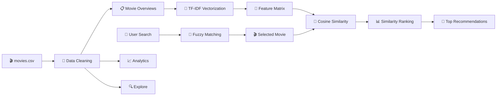
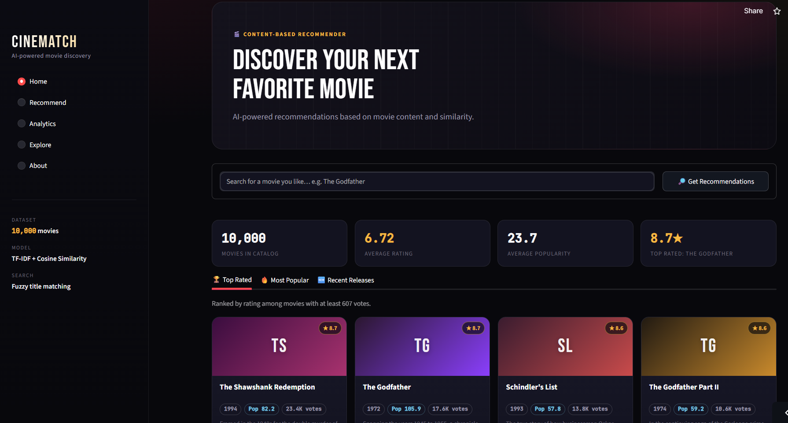
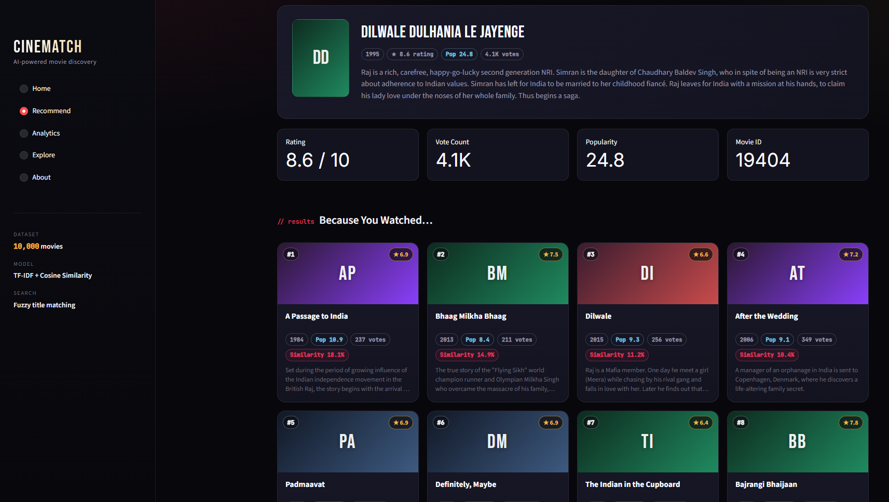
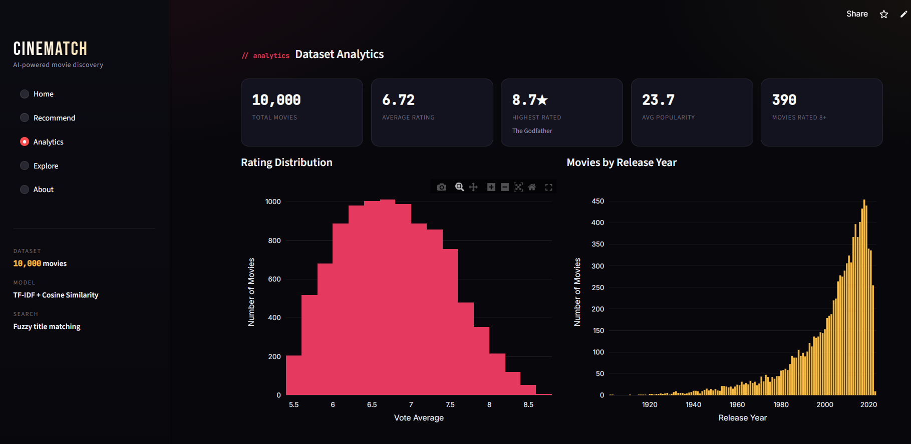
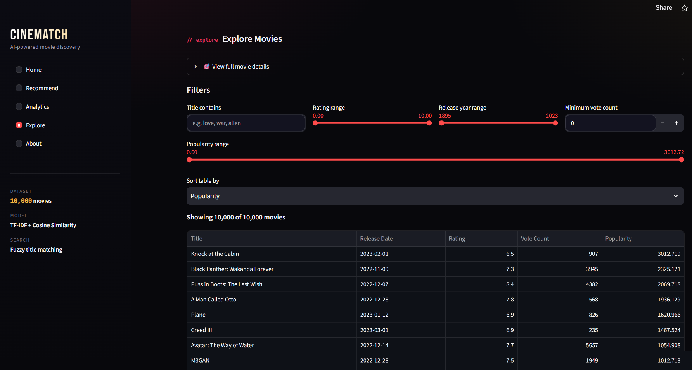

# 🎬 CineMatch — AI Movie Recommendation System


> **Discover your next favorite movie using Machine Learning & content similarity. 🎥**

CineMatch is an interactive **content-based movie recommendation system** built with Python and Streamlit.

It analyzes movie **overview text** using **TF-IDF vectorization** and **Cosine Similarity** to find movies with similar content. The application also includes interactive analytics, fuzzy movie search, filtering, sorting, and movie exploration.

---

# 📌 Project Overview

With thousands of movies available, finding something similar to a movie you already enjoy can be difficult.

CineMatch solves this using a **Content-Based Recommendation System**.

Simply search for a movie and CineMatch:

```text
Movie Search
     ↓
Fuzzy Title Matching
     ↓
Movie Overview
     ↓
TF-IDF Vectorization
     ↓
Cosine Similarity
     ↓
Similarity Ranking
     ↓
🎬 Recommended Movies
```

---

# ✨ Features

* 🎯 **Content-Based Movie Recommendations**
* 🧠 **TF-IDF Text Vectorization**
* 📐 **Cosine Similarity**
* 🔎 **Fuzzy Movie Title Search**
* 📊 **Interactive Analytics Dashboard**
* ⭐ Rating-based filtering
* 📅 Release-period filtering
* 🔥 Popularity-based sorting
* 🗳️ Vote-count filtering
* 🎬 Interactive movie cards
* 📈 Plotly visualizations
* 🌙 Modern dark-themed UI
* ⚡ Cached recommendation engine

---

# 🧠 Recommendation Engine

### Content-Based Filtering

CineMatch recommends movies by comparing the textual content of their **movie overviews**.

### TF-IDF

TF-IDF converts movie descriptions into numerical feature vectors by giving higher importance to words that are distinctive within the dataset.

### Cosine Similarity

Cosine similarity compares the TF-IDF vectors of movies.

```text
Similar Overview
       ↓
Similar TF-IDF Vector
       ↓
High Cosine Similarity
       ↓
Better Recommendation
```

> **Important:** The model measures textual similarity. It does not learn individual user preferences or understand movie plots semantically.

---

# 📊 Dataset

The application uses a movie dataset containing approximately **10,000 movie records**.

### Main Features

| Column         | Description          |
| -------------- | -------------------- |
| `id`           | Movie identifier     |
| `title`        | Movie title          |
| `overview`     | Movie description    |
| `release_date` | Movie release date   |
| `popularity`   | Popularity score     |
| `vote_average` | Average movie rating |
| `vote_count`   | Number of votes      |

---

# 🧹 Data Preprocessing

Before generating recommendations, the dataset goes through:

```text
Raw Movie Dataset
       ↓
Column Validation
       ↓
Text Cleaning
       ↓
Missing Value Handling
       ↓
Numeric Conversion
       ↓
Date Parsing
       ↓
Duplicate Removal
       ↓
Clean Movie Dataset
```

The application also removes invalid movie titles and handles missing numerical/text values.

---

# 📈 Analytics Dashboard

CineMatch includes an interactive analytics section with:

### ⭐ Rating Distribution

Understand how movie ratings are distributed across the dataset.

### 📅 Movies by Release Year

Explore the number of movies released over time.

### 📈 Rating vs Popularity

Analyze whether highly-rated movies are also highly popular.

### 🗳️ Vote Count vs Rating

Explore the relationship between audience votes and ratings.

### 🏆 Top Rated Movies

Identify the highest-rated movies while applying a minimum vote threshold.

---

# 🔎 Movie Exploration

The **Explore** section allows users to filter movies using:

```text
Title
  +
Rating Range
  +
Release Year
  +
Popularity
  +
Minimum Vote Count
```

Movies can then be sorted by:

* ⭐ Rating
* 🔥 Popularity
* 🗳️ Vote Count
* 📅 Release Date
* 🔤 Title

---

# 🔄 Project Workflow



---

# 🛠️ Tech Stack

| Technology          | Purpose                    |
| ------------------- | -------------------------- |
| 🐍 **Python**       | Core development           |
| 🐼 **Pandas**       | Data processing            |
| 🔢 **NumPy**        | Numerical operations       |
| 🤖 **Scikit-learn** | TF-IDF & Cosine Similarity |
| 📊 **Plotly**       | Interactive visualizations |
| 🎈 **Streamlit**    | Web application            |
| 🔎 **Difflib**      | Fuzzy title matching       |

---

# 📂 Project Structure

```text
CineMatch/
│
├── app.py
├── movies.csv
├── Movie Recommendation System.ipynb
├── README.md
└── requirements.txt
```

---

# ⚙️ Installation

### 1️⃣ Clone the Repository

```bash
git clone https://github.com/prathmesh2507/Movie-Reccomendation-System.git
cd Movie-Reccomendation-System
```

### 2️⃣ Install Dependencies

```bash
pip install -r requirements.txt
```

Or:

```bash
pip install pandas numpy scikit-learn plotly streamlit
```

### 3️⃣ Run the Application

```bash
streamlit run app.py
```

The application will be available at:

```text
http://localhost:8501
```

---

# 🎥 Application Screenshots

## 🏠 Home Dashboard



---

## 🎯 Movie Recommendations



---

## 📊 Analytics Dashboard



---

## 🔎 Explore Movies



> Replace the screenshot paths above with screenshots from your deployed application.

---

# 📌 Example

### Input

```text
🎬 The Godfather
```

### Processing

```text
The Godfather
      ↓
Movie Overview
      ↓
TF-IDF Vector
      ↓
Cosine Similarity
      ↓
Similarity Ranking
```

### Output

```text
#1  Similar Movie
#2  Similar Movie
#3  Similar Movie
#4  Similar Movie
#5  Similar Movie
```

Each recommendation displays information such as:

* ⭐ Rating
* 📅 Release year
* 🔥 Popularity
* 🗳️ Vote count
* 📐 Similarity score

---

# ⚠️ Model Limitations

CineMatch is intentionally a lightweight content-based recommender.

Current limitations include:

* TF-IDF depends on the vocabulary in movie overviews.
* Synonyms and paraphrased descriptions may not be recognized.
* No user watch history is used.
* No collaborative filtering is implemented.
* Short movie descriptions can produce weaker recommendations.
* Cosine similarity measures vocabulary overlap rather than true semantic understanding.

---

# 🚀 Future Improvements

* 🤖 Semantic embeddings using Transformers
* 🎭 Genre-aware recommendations
* 👤 Personalized user profiles
* ❤️ Watch history & favorites
* 🔄 Hybrid recommendation system
* 👥 Collaborative filtering
* 🎬 Movie poster/API integration
* 🌐 REST API backend
* 📱 Improved mobile experience
* ☁️ Production deployment

---

# 💡 Key Learning Outcomes

Through this project, I worked with:

* Data cleaning & preprocessing
* Text preprocessing
* Feature engineering
* TF-IDF vectorization
* Similarity-based recommendation
* Exploratory data analysis
* Interactive data visualization
* Streamlit application development
* Model limitations & interpretation

---

# 👨‍💻 Author

## Prathmesh Bhoyar

**AI Enthusiast • Data Analyst • Python Developer**

Building practical projects around **Data Analytics, Machine Learning & Python Development.**

---

# ⭐ Support

If you found this project useful, consider giving the repository a ⭐

**CineMatch — Find your next movie, based on what you already love. 🎬**
